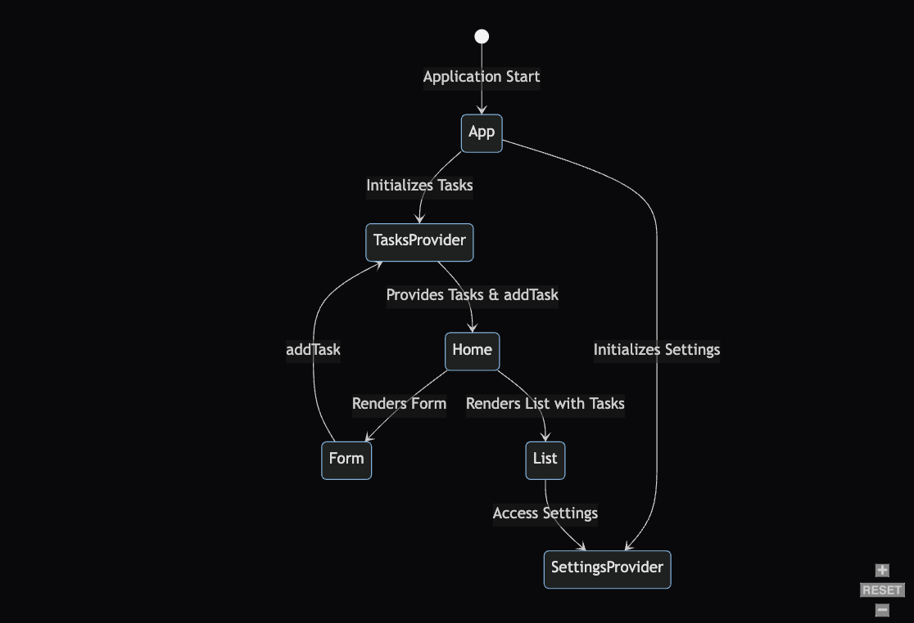

# LAB - Class 31

## Project: ToDo App

### Author: Bryan O. Garduno Gonzalez

### Problem Domain

The ToDo App assignment focuses on enhancing the user experience and functionality of a task management application through the implementation of a settings context component. This context component aims to standardize how elements are displayed to the user across the entire application, introducing a layer of customization and efficiency in task visualization and management. By leveraging the React context API, the app will provide application-wide settings for display preferences, including a default configuration that limits the visibility to three tasks per page, hides completed tasks, and introduces "difficulty" as a sorting criterion. These settings are designed to improve the user interface by simplifying task navigation, prioritizing user focus on active tasks, and streamlining the task organization process. The integration of these features, along with the use of the Mantine Pagination component, will offer users a more intuitive and manageable approach to tracking their to-dos, thereby addressing the common challenges associated with task management in digital platforms.

### Links and Resources

- Main [Deployment](https://todo-app-brosmar18.vercel.app/)

### Collaborators

- **ChatGPT by OpenAI**: Used as a programming partner for brainstorming ideas, debugging code, formulating tests, and drafting documentation.

### Setup

#### `.env` requirements (where applicable)

A .env file is included in local repository. A .env-sample file is uploaed to the remote repo so collaborators understand what environmental variables are being used.

#### How to initialize/run your application (where applicable)

- e.g. `npm start`

#### How to use your library (where applicable)

## Features

### Context-Driven Configuration

The ToDo App leverages React's Context API to manage global settings and tasks, enhancing the app's functionality and user experience. Two primary contexts, `SettingsContext` and `TasksContext`, centralize the app's configuration and task management.

- **Settings Context**: This context maintains the application's display preferences, including the number of tasks shown per page (`displayLimit`), the option to hide completed tasks (`hideCompleted`), and the default sorting field (`sortField`). These settings ensure a consistent and user-friendly interface across the application.

- **Tasks Context**: This context provides a structured way to manage tasks, offering functions to add, delete, and toggle the completion status of tasks. It serves as the backbone of the task management system, allowing for dynamic updates and interactions within the app.

### Modern UI with Mantine

The app incorporates the Mantine library to provide a modern and cohesive user interface. The `MantineProvider` wraps the entire application, ensuring that Mantine's styles and components are available throughout the app, promoting a uniform look and feel.

### Dynamic Routing with React Router

Utilizing `react-router-dom`, the app defines a structured layout and navigation system. The `App` component sets up a layout that includes a `Navbar`, a main content area (`Outlet`), and a `Footer`. This structure is complemented by dynamic routing, allowing for seamless navigation between different pages like Home, Tasks, Calendar, and Account without reloading the page.

### Task Management and UI Interaction

The application's task management is intricately designed to provide a user-friendly experience:

- **Adding Tasks**: Users can add new tasks to their list, expanding their to-do items effortlessly.
- **Deleting Tasks**: Tasks can be removed from the list, offering users control over their task management.
- **Toggling Task Completion**: The completion status of tasks can be toggled, providing a visual representation of task progress.

### Responsive Navbar with Framer Motion

The ToDo App introduces a responsive `Navbar` component, enhanced with animations using `framer-motion`. This feature enables a smooth transition for the mobile menu, creating an engaging user experience. The navbar dynamically adjusts to screen size, displaying a full menu for desktop views and a collapsible menu for mobile views, triggered by the `IconMenu2` icon. The collapsible state is managed by a `useState` hook, and the transition effect is applied as the menu slides in from the side, providing a modern and interactive navigation system.

### Custom Form Hook for Task Management

A custom `useForm` hook streamlines form handling within the app, encapsulating functionality for managing form state, handling changes, and submitting form data. This abstraction simplifies form implementation across the app, ensuring consistency and reducing boilerplate code. The hook is utilized in the `Form` component, where users can add new tasks, specifying details such as the task description, assignee, and difficulty level. The form leverages the `useTasks` context for adding tasks to the global state, demonstrating a seamless integration of custom hooks and context for state management.

### Task Addition with Dynamic Form

The `Form` component, empowered by the `useForm` hook, offers a user-friendly interface for adding tasks. It includes input fields for task details, assignee, and a difficulty level slider, providing an intuitive way for users to define their tasks. Upon submission, tasks are assigned a unique ID using `uuid`, marked as incomplete by default, and added to the task list through the `addTask` function from `TasksContext`. This feature not only enhances the app's interactivity but also showcases the effective use of custom hooks, context API, and external libraries to manage and expand the app's functionality.

## Tests 

### Testing Setup and Implementation

- **Testing Framework**: Utilization of Vitest for effective React component and application logic testing.

- **Test Environment Configuration**: Adjustments in `vite.config.js` and `.eslintrc.cjs` to align with the React Testing Library.

- **Testing Scripts**: The `package.json` includes a test script for executing tests with coverage reporting.

- **React Testing Integration**: Empowers user-centric testing for React components. 

- **Global Test Setup**: Implemented in `tests/setup.js`, standardizing testing behaviors, including cleanup after each test.

### Component Testing

The ToDo App emphasizes thorough testing for each of its components to ensure functionality and user satisfaction. Here's an overview of the testing approaches for key components:

#### Form Component (`Form/Form.test.jsx`)

The tests for the Form component focus on its rendering and interaction capabilities. It includes checks to ensure all form elements are correctly displayed, such as input fields for task details, assignee, and difficulty level, as well as the submit button. Additionally, it tests user interactions with the form, verifying that input values are accurately captured and handled within the component.

#### Navbar Component (`Navbar/Navbar.test.jsx`)

The Navbar component tests ensure that the navbar is properly rendered, including the display of the logo and navigation links for different sections of the app like Home, Tasks, Calendar, and Account. Tests also cover the responsive aspects of the Navbar, particularly the functionality of the mobile menu icon and the display of navigation links in a mobile view.

#### Footer Component (`Footer/Footer.test.jsx`)

Testing for the Footer component verifies its presence and the correct rendering of social media icons, such as Instagram, Twitter, and YouTube. The tests confirm that the footer is displayed with all social icons, ensuring the app's footer maintains consistent branding and provides user access to social channels.

These tests collectively ensure the components of the ToDo App are reliable and function as intended, providing a solid user experience.

### Running the Tests

To run the tests, execute the `npm test` command.

### Incomplete or Skipped Tests  

At this stage, all essential component tests have been implemented. Any future tests or enhancements will be noted in subsequent updates or phases.

#### UML

;
